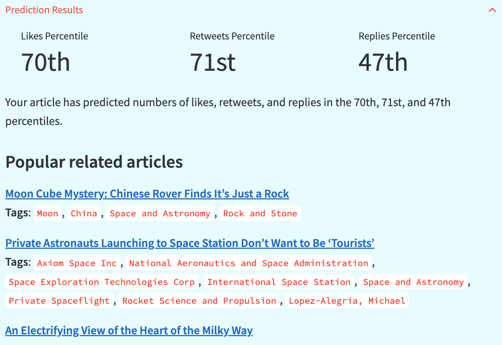
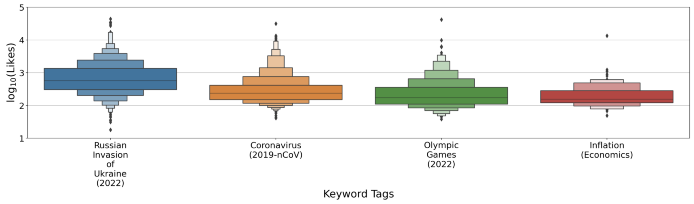
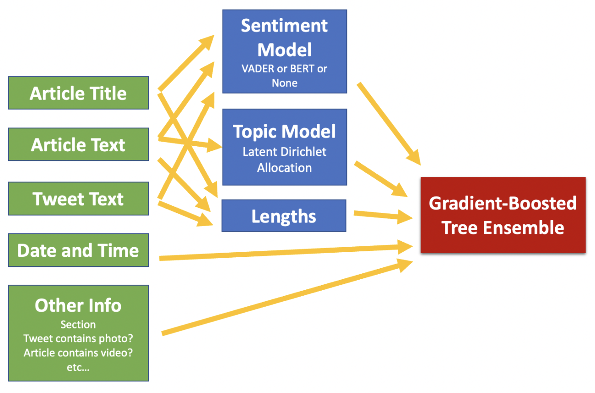

# News Popularity

This is a web app for predicting how popular a news article would be, as measured by Twitter likes, retweets, and replies. The web app is available [here](https://dilwong-newspopularity-app-minexj.streamlitapp.com/) but can also be run locally via `streamlit run app.py` (dependencies in `requirements.txt`).

Simply input information such as the title of your news article, the subheading, the article text, the date and time of posting on Twitter, etc..., and the web app will return the likes/retweets/replies metrics as percentiles with respect to a corpus of news articles from [the New York Times](https://www.nytimes.com/). The web app will also return the three most popular articles on the same topic and the three least popular related articles.

<!---  --->

The web app also has a `Visualizations` tab where users can explore the various factors that make news articles popular or unpopular.

## Problem Statement

Over the last two decades, newspaper circulation and press news advertising revenue have been in steep decline, with advertising revenue falling by [a factor of five](https://www.pewresearch.org/fact-tank/2021/07/27/6-key-takeaways-about-the-state-of-the-news-media-in-2020/ft_21-07-21_sotnmkeytakeaways_1/). In this competitive business climate, it is important to know what makes a news article likely to be viewed by potential readers. Ultimately, the strategy that a news outlet will pursue to increase its viewership will depend on the outlet's journalistic integrity and willingness to publish clickbait, but the effectiveness of any such strategy will likely be enhanced by a proper understanding of the various factors that contribute to an article's popularity. This project is aimed at news organizations and journalists interested in exploring these factors.

## Methodology

Twitter likes/retweets/replies are used as a proxy for the popularity of a news article, as I do not have access to page view statistics. In addition to being a proxy for popularity, Twitter metrics are intrinsically a good target because deploying a strategy for increasing likes/retweets/replies may also lead to articles being shared more often on social media, possibly increasing advertising revenue.

The web app's predictions are generated by a model trained on ~9,000 news articles scrapped (using [Selenium](https://www.selenium.dev)) from the New York Times (NYT) between January 2022 and April 2022 (and like/retweet/reply counts are scrapped from [Twitter](https://twitter.com/nytimes), of course). As such, the model is less suited for audiences outside the NYT's core demographic (e.g. smaller newspapers, Fox News, etc...). Additionally, since the popularity of topics changes over time, the model is likely outdated by now (but scrapping new articles and retraining the model is straightforward).

A schematic of the model is shown below. After processing using [Spacy](https://spacy.io), the text of a news article is fed into a [Latent Dirichlet Allocation (LDA)](https://radimrehurek.com/gensim/auto_examples/tutorials/run_lda.html) model to extract the topic weights of the article. Text elements were also fed into a rule-based sentiment model ([VADER](https://github.com/cjhutto/vaderSentiment)) and transformer-based sentiment models (BERT), but the final deployed model does not include a sentiment model because the small improvement in accuracy was not worth the resources (BERT takes up a lot of memory). Other features included in the model are text lengths, news section, the day of the week, the time of day (encoded using radial basis functions), whether the article included video/audio, whether the tweet included a photo/video, and whether readers were allowed to comment on the article. All this information (precomputed and stored in a database to save computation time) was then used to train a gradient-boosted ensemble trees model ([LightGBM](https://github.com/microsoft/LightGBM) because it handles categorical and missing data natively). Hyperparameters are optimized using [Optuna](https://optuna.org).

Since the LDA model is the workhorse of the web app, I will describe it briefly here. LDA is a generative model that pretends each news article is a bag of words. Each article is described by a multinomial distribution over topics (the multinomial distribution is sampled from a Dirichlet prior). Each topic is a multinomial distribution over words (sampled from a different Dirichlet prior). Each word from each article is sampled by first generating the topic for that word and then sampling a word from that topic. A key hyperparameter for LDA is the number of topics, which is usually determined by evaluating some sort of "coherence score." However, instead of using a coherence score, since the LDA model here generates features for an ensemble of regression trees, I chose the number of topics (130) that minimizes the mean squared error (for predicting the log of the number of likes/retweets/replies) on a validation set.

## Performance

Out-of-sample R^2 (i.e. evaluated on a test set) for each model (log(likes), log(retweets), log(replies)) is ~0.4. I do not know if a significantly larger value of R^2 can be achieved, as human behavior tends to have high variability that is difficult to explain. A model that is predominantly based on article topics is likely unable to adequately account for the variance in the popularity of the news articles. Moreover, I'm somewhat skeptical that people actually read a news article when they like, retweet, or reply to a news article, so analyzing the text of the article to determine popularity may be misguided (some weak evidence for this possibility is that feature importance metrics (number of splits on a feature, total gain for each feature, Shapley values) obtained from the tree models seem to favor features related to the tweet (e.g. if the tweet contains a photo) but not similar characteristics of the article itself).

Nevertheless, here are a few ideas for possibly improving the model:
- Counterintuitively, the performance gain from including a sentiment model is quite small. This could be because canned sentiment models are missing context. Bad things happening to Russia during its invasion of Ukraine is positive news from the perspective of the NYT's Western readership, but VADER and pretrained BERT models don't recognize this. Labeling the sentiment of some news articles by hand and training a new sentiment model may alleviate this issue.
- Novelty is probably quite important for the popularity of a news article, and this is missing from my model. Perhaps incorporating some sort of per topic time series could help here. Or perhaps what is considered a hot topic changes on a time scale faster than 1/3 of a year, so restricting the time interval from which the training data is obtained could help.
- Since the LDA model doesn't require like/retweet/reply counts, I could have trained the LDA model on a larger corpus of news articles to get a better topic model. Perhaps I could have even trained the LDA model on text sources that are not news articles or simply have used a pretrained LDA model.
- There are a bunch of other methods for modeling the topic of a news article, such as soft clustering algorithms (e.g. Gaussian mixtures), latent semantic analysis ([LSA, also provided by Gensim](https://radimrehurek.com/gensim/models/lsimodel.html)), and LDA with TF-IDF vectors (it doesn't make sense, but Gensim can still do it).
- Use a sequence-to-one model (e.g. just use BERT for regression).
- More aggressive regularization.

## Data

Tweet metrics are available [here](https://www.kaggle.com/datasets/dilwong/newspopularity), and OpenAI text-embedding-ada-002 embeddings for each news article (not used in the model) are available [here](https://www.kaggle.com/datasets/dilwong/openai-embeddings-for-new-york-times-articles).